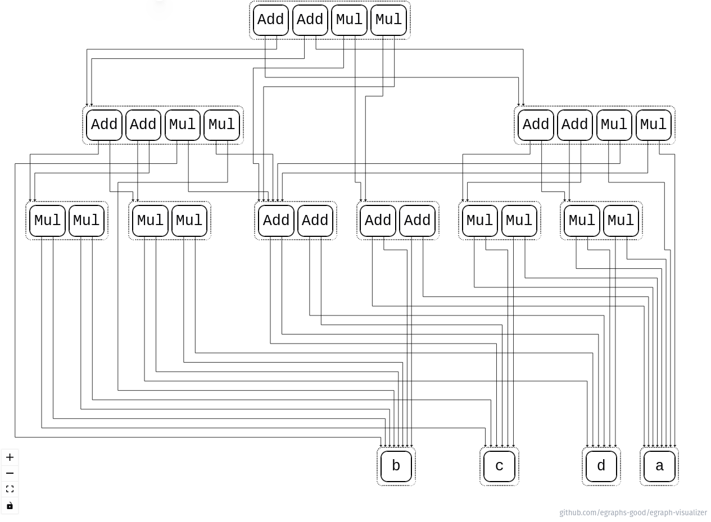

## Results of first couple of weeks

I have created a simple toy that uses egg crate to rewrite a simple mathematical statement `((a * c) + (a * d)) + ((b * c) + (b * d))` using following rules:

```rust
let rules: &[Rewrite<Math, ()>] = &[
    rewrite!("commute-add"; "(+ ?a ?b)" => "(+ ?b ?a)"),
    rewrite!("commute-mul"; "(* ?a ?b)" => "(* ?b ?a)"),
    rewrite!("mult-zero";   "(* ?a 0)"  => "0"),
    rewrite!("add-zero";    "(+ ?a 0)"  => "?a"),
    rewrite!("factor";     "(+ (* ?a ?b) (* ?a ?c))" => "(* ?a (+ ?b ?c))"),
];
```

Those rules are sufficient to simplify that statement to some version of `(c+d)(a+b)`.

### Visualisation

Egg has released their debug tools ([egraph visualiser](https://egraphs-good.github.io/egraph-visualizer/), [egraph json serialiser](https://github.com/egraphs-good/egraph-serialize)) that I have used to understand iterations that egg framework is doing to rewrite.

Below you can see an image of saturated reduction of `((a * c) + (a * d)) + ((b * c) + (b * d))` using the rules I listed above.



### Check-point

You can find all the code that has been processed on this iteration on my first-iter branch [here](https://github.com/YehorBoiar/egg-toy/tree/first-iter)